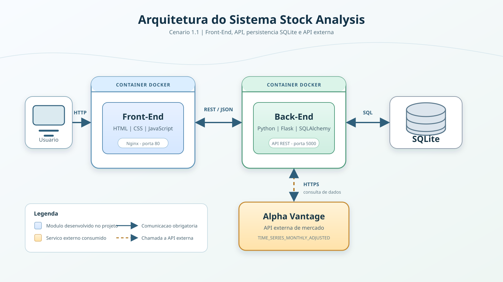

# Stock Analysis Front-End

## Arquitetura



## Docker

Este componente possui um `Dockerfile` proprio. Execute os comandos abaixo no
PowerShell dentro da pasta `FrontEnd`.

### Build da imagem

```powershell
docker build -t puc-rio-frontend .
```

### Execucao do container

```powershell
docker run --name puc-rio-frontend-container -p 8080:80 puc-rio-frontend
```

O mapeamento `8080:80` publica o Nginx em `http://127.0.0.1:8080`.

Antes de usar a interface, inicie o container do backend conforme as
instrucoes em `BackEnd/README.md`. O JavaScript do frontend consome a API em
`http://127.0.0.1:5000`.

Interface Web desenvolvida em HTML, CSS e JavaScript para consumo da Stock Analysis API, permitindo realizar análises de ações e visualizar os resultados em formato de tabela.

---

## 🎯 Funcionalidades

- Enviar ticker para análise via API
- Listar ações classificadas como `SIM` ou `NAO` para comprar
- Consultar e deletar análises específicas por ticker
- Exibir dados retornados da API em tabela HTML
- Tratamento de erros de comunicação com a API

---

## 🛠️ Tecnologias Utilizadas

- HTML5
- CSS3
- JavaScript (Fetch API)

---

## 📋 Pré-requisitos

- Navegador Web (Chrome, Edge ou Firefox)
- Back-End rodando localmente em:
```
http://localhost:5000
```

---

## ▶️ Como Executar

### Abrir diretamente no navegador
1. Navegue até a pasta do projeto
2. Abra o arquivo `index.html` no navegador

---

## ⚙️ Configuração de API

O Front-End consome a API em:
```
http://localhost:5000
```

---

## ℹ️ Observações

- O Front-End depende diretamente da API para funcionamento.
- Certifique-se de que o Back-End esteja rodando antes de utilizar a interface.
